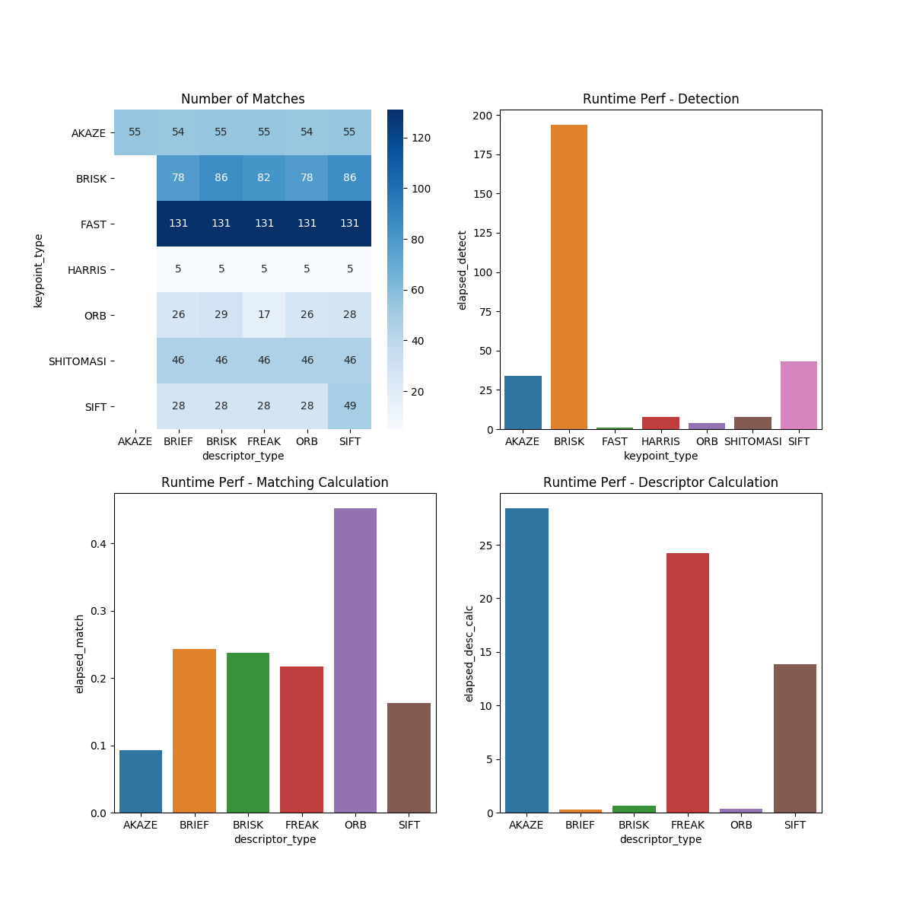

# SFND 2D Feature Tracking

# Midterm Writeup

## Objective
Compare various 2D feature detectors and feature descriptors available in OpenCV 4.1. Features were compared 
by inspecting runtime performance, overall number of keypoints extracted, and qualitative matching performance.

## Method
The original bounding box for the center vehicle encompassed areas of the image that contained non-vehicle 
features, such as lane markings. To reduce the number of false-positives and avoid manual counting, the bounding box was reduced until the number 
of these false positives was minimized. This reduction may have reduced number of keypoints on the edges of the vehicle.
However, since surface profile edges on modern cars tend to be rounded, the "profile" keypoints are less likely to make good 
features to track as the vehicle undergoes perspective transformation. Rather, the "interior" points are of greater interest.

## Results (MP8, MP9)

Figure 1 (upper left corner) shows the number of matches made (avoid ratio-based filtering) for each combination
of keypoint-detector and feature descriptor, averaged over all 10 images. Note that AKAZE keypoints were only tested with AKAZE descriptors for 
compatibility.  

### Qualitative Notes

Although the FAST detector detected the most amount of points, the stability of those points over a number of 
frames was much less than other keypoint detectors such as ORB or SIFT. It's worth noting 
that ORB uses FAST as a component.

The feature detectors with larger neighborhoods such as AKAZE and ORB 

### Feature Neighborhood Size (MP7)
In terms of the spatial scope of the features (Task MP.7), the following are qualitative notes. Here we compare 
based on detector keypoint output.
1. ORB: tends to have large neighborhoods, possibly detecting the same feature at multiple scales with default settings.
2. SIFT: distribution of neighborhoods tends to be smaller (10-50 pixels), and there aren't as many overlapping 
features of different scales as in ORB. However, out of the detectors that contained wider scale features (AKAZE, ORB), SIFT
was the only one that detected finer points on the license plate letters. 
3. AKAZE: Smaller feature neighborhoods, roughly on par with SIFT
4. BRISK: Larger feature neighborhoods. Tends to be larger than SIFT, but the maximum size is smaller than ORB. Less
feature overlap than in ORB.
5. FAST: Smaller point-size features of roughly constant diameter, about 5px.
3. Shi-Tomasi and Harris: Smaller point features.

## Recommendations (MP9)

Based on the runtime performance results, BRISK would not be ideal for real-time scenarios with limited processing power. 
For feature detection, would should likely use a combination of AKAZE or AKAZE, ORB, and Shi-Tomasi to detect features 
at the best distribution of scales. For detecting fine features at small scale, Shi-Tomasi might be the top choice, while larger
scale features, one should go with AKAZE, ORB, or SIFT.

For feature descriptors, when looking across the rows in the upper left figure, we can see which descriptors resulted
in higher numbers of matches after ratio-based filtering. BRISK, SIFT, and FREAK tended to perform the best here. Note, however,
that FREAK performed poorly using ORB features, which is indicative of the scale of the FREAK descriptor relative to ORB 
key-points.  

Based on this analysis, the following recommendations are made:

1. Use SIFT/SIFT
2. Use (AKAZE+Shi-Tomasi)/BRISK
3. Use (ORB+Shi-Tomasi)/BRISK

# Original Readme

The idea of the camera course is to build a collision detection system - that's the overall goal for the Final Project. As a preparation for this, you will now build the feature tracking part and test various detector / descriptor combinations to see which ones perform best. This mid-term project consists of four parts:

* First, you will focus on loading images, setting up data structures and putting everything into a ring buffer to optimize memory load. 
* Then, you will integrate several keypoint detectors such as HARRIS, FAST, BRISK and SIFT and compare them with regard to number of keypoints and speed. 
* In the next part, you will then focus on descriptor extraction and matching using brute force and also the FLANN approach we discussed in the previous lesson. 
* In the last part, once the code framework is complete, you will test the various algorithms in different combinations and compare them with regard to some performance measures. 

See the classroom instruction and code comments for more details on each of these parts. Once you are finished with this project, the keypoint matching part will be set up and you can proceed to the next lesson, where the focus is on integrating Lidar points and on object detection using deep-learning. 

## Dependencies for Running Locally
* cmake >= 2.8
  * All OSes: [click here for installation instructions](https://cmake.org/install/)
* make >= 4.1 (Linux, Mac), 3.81 (Windows)
  * Linux: make is installed by default on most Linux distros
  * Mac: [install Xcode command line tools to get make](https://developer.apple.com/xcode/features/)
  * Windows: [Click here for installation instructions](http://gnuwin32.sourceforge.net/packages/make.htm)
* OpenCV >= 4.1
  * This must be compiled from source using the `-D OPENCV_ENABLE_NONFREE=ON` cmake flag for testing the SIFT and SURF detectors.
  * The OpenCV 4.1.0 source code can be found [here](https://github.com/opencv/opencv/tree/4.1.0)
* gcc/g++ >= 5.4
  * Linux: gcc / g++ is installed by default on most Linux distros
  * Mac: same deal as make - [install Xcode command line tools](https://developer.apple.com/xcode/features/)
  * Windows: recommend using [MinGW](http://www.mingw.org/)

## Basic Build Instructions

1. Clone this repo.
2. Make a build directory in the top level directory: `mkdir build && cd build`
3. Compile: `cmake .. && make`
4. Run it: `./2D_feature_tracking`.